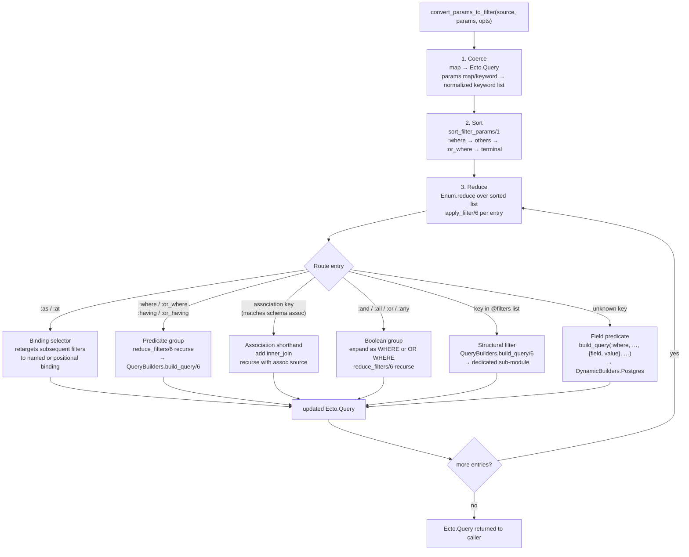

# Filter Pipeline

This document explains how `EctoShorts.CommonFilters.convert_params_to_filter/3`
processes your params map into an `Ecto.Query`. For a quick reference of every
recognized key, see the [Filter Key Reference](../reference/filter-keys.md).

---

## Overview

`convert_params_to_filter/3` is the single entry point for EctoShorts' query
language. You pass a source (schema module, `{source, schema}` tuple, or
existing `Ecto.Query`) and a map or keyword list of params; you get back a
fully assembled `Ecto.Query` ready to hand to your repo.

The function runs in three phases: **coerce**, **sort**, and **reduce**.



---

## Normalization Phase

Before any filter is applied, `EctoShorts.CommonFilters.Normalizer.normalize/2`
converts all string structural keys (`"where"`, `"order_by"`, etc.) to atoms
using a compile-time lookup map. Association names are resolved via schema
reflection. User-defined identifiers (CTE names, binding names) use
`String.to_existing_atom/1` with rescue.

This is the ONLY place string-to-atom conversion happens. Filter modules
downstream always receive atom-keyed data.

---

## Phase 1: Coerce

`CommonSchema.to_query/1` converts the `source` argument into an `Ecto.Query`:

- A schema module becomes `from s in SchemaModule`.
- An existing `Ecto.Query` is passed through unchanged.
- A `{source_string, schema_module}` tuple builds a schemaless query.

The `params` argument may be a map or a keyword list. Both forms are supported
throughout the pipeline. Use a keyword list when you need duplicate keys (e.g.
multiple `:where` entries in a specific order) or when evaluation order within
a group matters.

---

## Phase 2: Sort

`sort_filter_params/1` reorders the normalized params into a canonical
evaluation sequence:

1. **`:where` entries** — applied first so regular predicates narrow the
   result set before any OR logic or structural changes.
2. **All other filter entries** — structural filters (joins, limits, preloads,
   set operations, etc.) in the order they appear in the params.
3. **`:or_where` entries** — always follow `:where` clauses so OR conditions
   are not accidentally hoisted above AND conditions.
4. **Terminal entries** (`:last`, `:subquery`) — applied last because they
   depend on the fully-assembled query (`:last` reverses the current ordering;
   `:subquery` wraps the entire query as a subquery).

```elixir
# Input
[last: 5, or_where: %{published: false}, where: %{active: true}, limit: 10]

# After sort_filter_params/1
[where: %{active: true}, limit: 10, or_where: %{published: false}, last: 5]
```

If you need a custom evaluation order, pass a `:sorter` option:

```elixir
EctoShorts.CommonFilters.convert_params_to_filter(Post, params,
  sorter: fn kw -> Enum.sort_by(kw, fn {k, _} -> k end) end
)
```

---

## Phase 3: Reduce

`Enum.reduce/3` walks the sorted list, threading the accumulated
`Ecto.Query` through each entry via `apply_filter/6`.

Each entry is dispatched to one of four routing families:

### Family 1: Binding selectors (`:as`, `:at`)

`:as` and `:at` retarget subsequent filter applications to a specific named
or positional binding. The value must be a map or keyword list where each
key names (or positions) the binding and the value contains the filters to
apply there.

```elixir
# Apply an ilike filter to the :comments binding
EctoShorts.CommonFilters.convert_params_to_filter(Post, %{
  join: :comments,
  as: %{comments: %{body: %{ilike: "hello"}}}
})
```

Binding selectors are first-class public keys — they are not wrapped in a
`:bind` or similar container.

### Family 2: Predicate groups (`:where`, `:or_where`, `:having`, `:or_having`)

When the value is a map or keyword list, `reduce_filters/6` recurses into it,
applying each `{field, value}` pair as a field-level predicate. When the
value is a scalar (not a map or keyword), `QueryBuilders.build_query/6` is
called directly, which dispatches to the active `DynamicBuilder`.

Field-level predicates are resolved by `EctoShorts.CommonFilters.PredicateBuilder`
into a `EctoShorts.CommonFilters.Predicate` struct, which the
`DynamicBuilder` adapter (by default `EctoShorts.DynamicBuilders.Postgres`)
converts into an `Ecto.Query.dynamic/2` expression.

### Family 3: Association shorthand

When a key matches a declared association on the source schema (checked via
`CommonSchema.get_schema_reflection/3`), EctoShorts:

1. Emits an `inner_join` via `CommonFilters.Filters.Join`, binding the
   association as `:ecto_shorts_<assoc_name>`.
2. Recurses with the association's queryable as the new source and the
   association's filter value as the new params.

```elixir
# Auto-joins :comments and applies ilike on comments.body
EctoShorts.CommonFilters.convert_params_to_filter(Post, %{
  comments: %{body: %{ilike: "hello"}}
})
```

Association shorthand works for schema-backed sources and for
`{source_string, schema_module}` tuples (the schema module provides the
reflection).

### Family 4: Structural filters (keys in `@filters`)

All remaining recognized keys (the `@filters` list — `:limit`, `:order_by`,
`:preload`, `:union`, etc.) are dispatched to `QueryBuilders.build_query/6`,
which routes to the dedicated filter sub-module under
`EctoShorts.CommonFilters.Filters`. Each sub-module implements the
`EctoShorts.QueryBuilder` callback and returns an updated `Ecto.Query`.

Unknown keys (not in `@filters` and not matching an association) are treated
as direct field predicates against the current binding.

---

## Expression Building

Structural and predicate sub-modules call into `EctoShorts.DynamicBuilders`
to produce `Ecto.Query.dynamic/2` expressions. Today only
`EctoShorts.DynamicBuilders.Postgres` ships. It routes predicates to:

| `Predicate.routing` | Module | Handles |
|---|---|---|
| `:scalar` | `Postgres.ScalarExpr` | Comparison, string, membership, aggregate, arithmetic |
| `:array` | `Postgres.ArrayExpr` | Postgres `&&`, `@>`, `<@` array operators |
| `:map` | `Postgres.MapExpr` | JSONB `@>`, `<@`, `jsonb_exists` operators |
| `:common` | `Postgres.CommonExpr` | Cursor pagination (`:before`/`:after`/`:since`/`:until`), `:exists` |

To use a different adapter, implement `EctoShorts.DynamicBuilder` and pass
it per-call via `:dynamic_builder` or globally via
`config :ecto_shorts, dynamic_builder_module: MyAdapter`.

---

## Compile-Time Binding Generation

Every filter sub-module calls
`QueryBinding.query_binding_contracts(__MODULE__)` at module body level. This
macro generates one `build_query` function clause per binding shape (root,
named, positional). Binding dispatch at runtime is therefore a plain pattern
match with no conditional logic or map lookup.

Increasing `max_positional_bindings` above the default of 10 increases
compile time proportionally because each extra value adds one function clause
per sub-module.

---

## Cross-References

- [Filter Key Reference](../reference/filter-keys.md) — every recognized key with types and examples
- [Filtering Guide](../guides/filtering.md) — usage-oriented walkthrough
- [Architecture](architecture.md) — component relationships and adapter extension points
- [API Reference](../reference/api-reference.md) — `convert_params_to_filter/3` signatures
