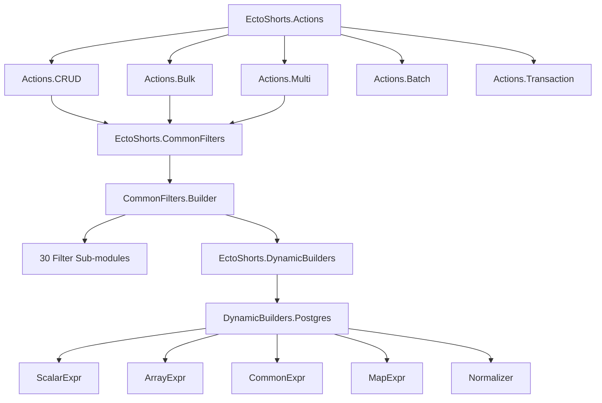
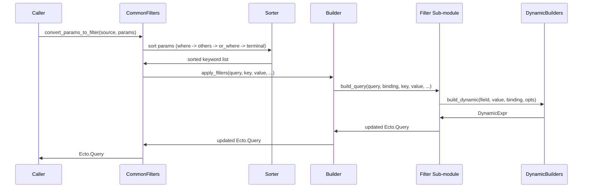
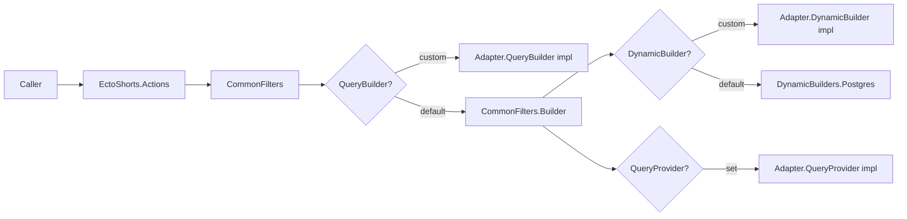
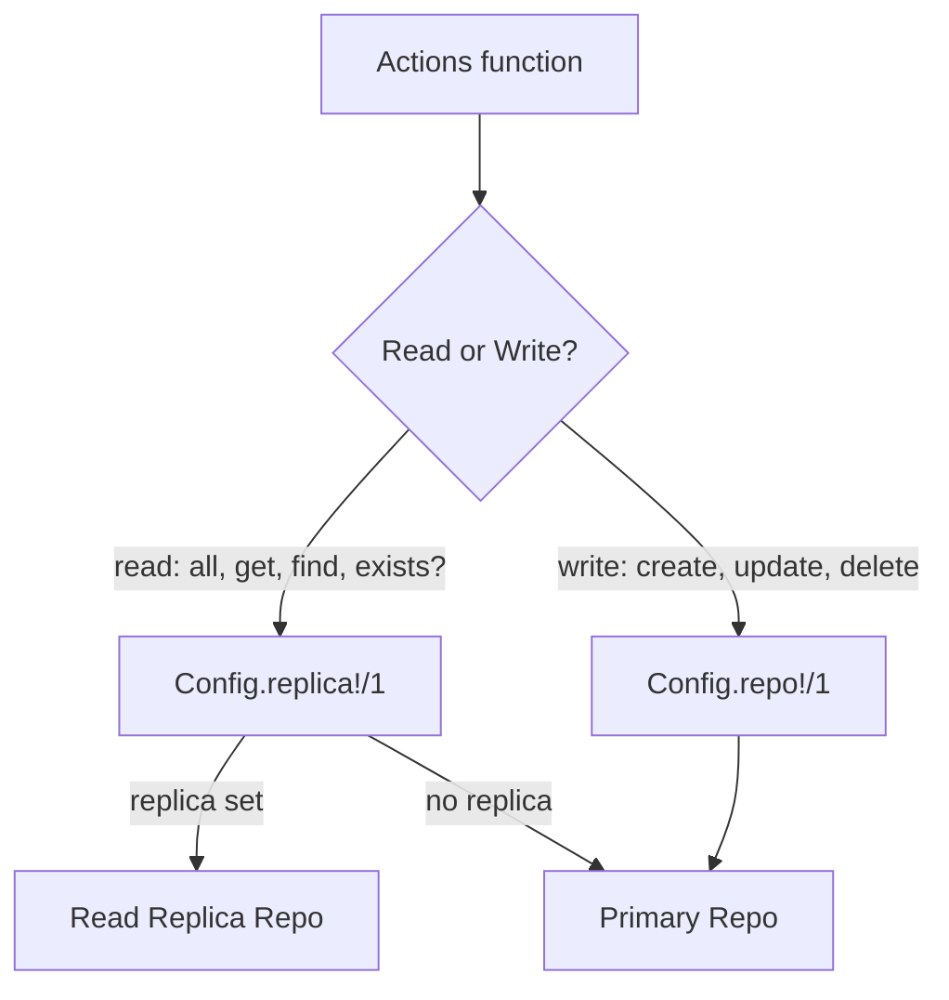

# EctoShorts System Architecture

## Component Relationships



## Filter Pipeline Data Flow



### Pipeline Steps in Detail

1. **Param coercion** -- `convert_params_to_filter/3` accepts maps or keyword lists and normalizes to a keyword list.
2. **Sorting** -- `CommonFilters.Sorter` reorders entries into the canonical sequence:
   - `:where` predicates first (establish the base filter set)
   - All structural filters in declaration order (joins, limits, preloads, etc.)
   - `:or_where` predicates (always follow `:where` to match SQL semantics)
   - Terminal filters last: `:last`, `:subquery`
3. **Reduction** -- `CommonFilters.Builder` iterates the sorted keyword list. Each entry is dispatched through `apply_filters/6`.
4. **Dispatch** -- `apply_filters` routes each key to one of:
   - Binding operators (`:as`, `:at`) -- retarget subsequent filters to a named or positional binding
   - Predicate filters (`:where`, `:or_where`) and boolean groups (`:and`, `:or`) -- build `DynamicExpr`
   - Association shorthand -- triggers implicit join and recurses with association source
   - Structural filters -- delegated to a dedicated sub-module
5. **Expression building** -- Structural and predicate sub-modules call into `EctoShorts.DynamicBuilders` to produce `Ecto.Query.dynamic/1` expressions from field/value pairs.
6. **Query accumulation** -- Each sub-module returns an updated `Ecto.Query`; the builder threads this through the reduction.

## Adapter Extension Points



### QueryBuilder

Implementing `EctoShorts.Adapter.QueryBuilder` allows full replacement of how a filter key is applied to the query. Set globally:

```elixir
config :ecto_shorts, query_builder_module: MyApp.CustomQueryBuilder
```

Or per-call via `EctoShorts.QueryBuilders`:

```elixir
EctoShorts.QueryBuilders.build_query(:where, User, query, binding, term, query_builder_module: MyApp.CustomQueryBuilder)
```

### DynamicBuilder

Implementing `EctoShorts.Adapter.DynamicBuilder` allows replacing dynamic expression compilation, for example to support a different database dialect. Set globally:

```elixir
config :ecto_shorts, dynamic_builder_module: MyApp.MySQLDynamicBuilder
```

Or per-call via the `:dynamic_builder` runtime option (no `_module` suffix):

```elixir
EctoShorts.Actions.all(User, %{...}, dynamic_builder: MyApp.MySQLDynamicBuilder)
```

### QueryProvider

Implementing `EctoShorts.Adapter.QueryProvider` supplies named query fragments used by structural filters such as `:lock`. Set globally:

```elixir
config :ecto_shorts, query_provider_module: MyApp.QueryProvider
```

## Read/Write Routing



Read functions: `all`, `get`, `find`, `exists?`, `stream`, `aggregate`, `preload`, `find_many`.

Write functions: `create`, `update`, `delete`, `insert_all`, `update_all`, `delete_all`, `create_many`, `update_many`, `delete_many`, and all `find_and_*` / `find_or_*` variants.

`find_or_create` and related compound operations use the replica for the read phase and the primary for the write phase within a single call.

## Compile-Time Binding Generation

Every filter sub-module calls `QueryBinding.query_binding_contracts(__MODULE__)` at module body level (not inside a function). This macro generates one `build_query` function clause per binding shape:

- **Root binding** -- the default unnamed binding, applied to the first `from` source.
- **Named binding** (`:as`) -- applied to a specific named binding, e.g. `as: :comments`.
- **Positional binding** (`:at`) -- applied to binding at index N, up to `max_positional_bindings`.

Result: binding dispatch at runtime is a simple pattern match. There is no runtime conditional logic, no map lookup, and no dynamic dispatch overhead for binding resolution.

Increasing `max_positional_bindings` above the default (10) increases compile time proportionally because each additional value generates one more function clause per sub-module.

## Association Shorthand Auto-Join

When `apply_filters` encounters a key that matches a declared association on the source schema, it:

1. Infers the join target from the schema's association metadata.
2. Emits an `inner_join` via `CommonFilters.Join`, binding the association as `:ecto_shorts_<assoc_name>`.
3. Recurses with the association's source schema and the association's filter value.

Example: `%{comments: %{body: %{ilike: "hello"}}}` on `Post` produces a join on `comments` followed by an `ilike` predicate on the `comments` binding.

Schemaless queries (`{source, schema}` tuple) support association shorthand when the schema module is provided.

## Binding Selector Threading

`:as` and `:at` are stateful within a single `convert_params_to_filter` call. Once encountered, they retarget all subsequent filter applications to the specified binding until another `:as`/`:at` appears or the reduction ends.

This allows applying multiple filters to a joined binding without repeating the join name on each filter entry:

```elixir
%{
  join: :comments,
  as: :comments,
  where: %{body: %{ilike: "hello"}},
  order_by: [asc: :inserted_at]
}
```

Both `:where` and `:order_by` above are applied to the `:comments` binding.

## Cross-References

- [Codebase Summary](codebase-summary.md) -- directory layout and key file index
- [API Reference](api-reference.md) -- complete function signatures
- [Configuration Guide](configuration-guide.md) -- adapter and repo configuration
- [Code Standards](code-standards.md) -- how to add new filters and adapters
